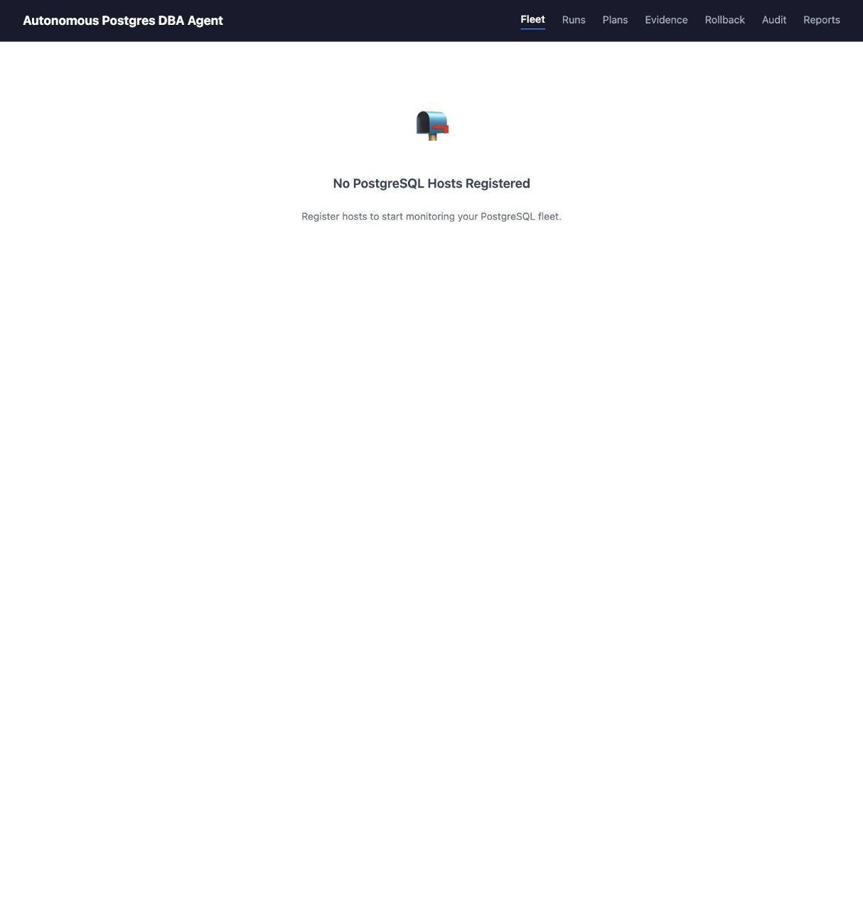
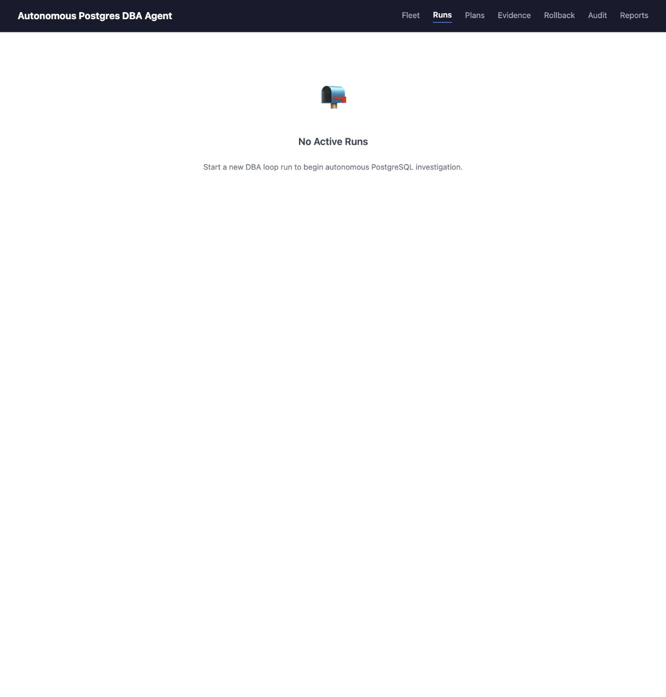
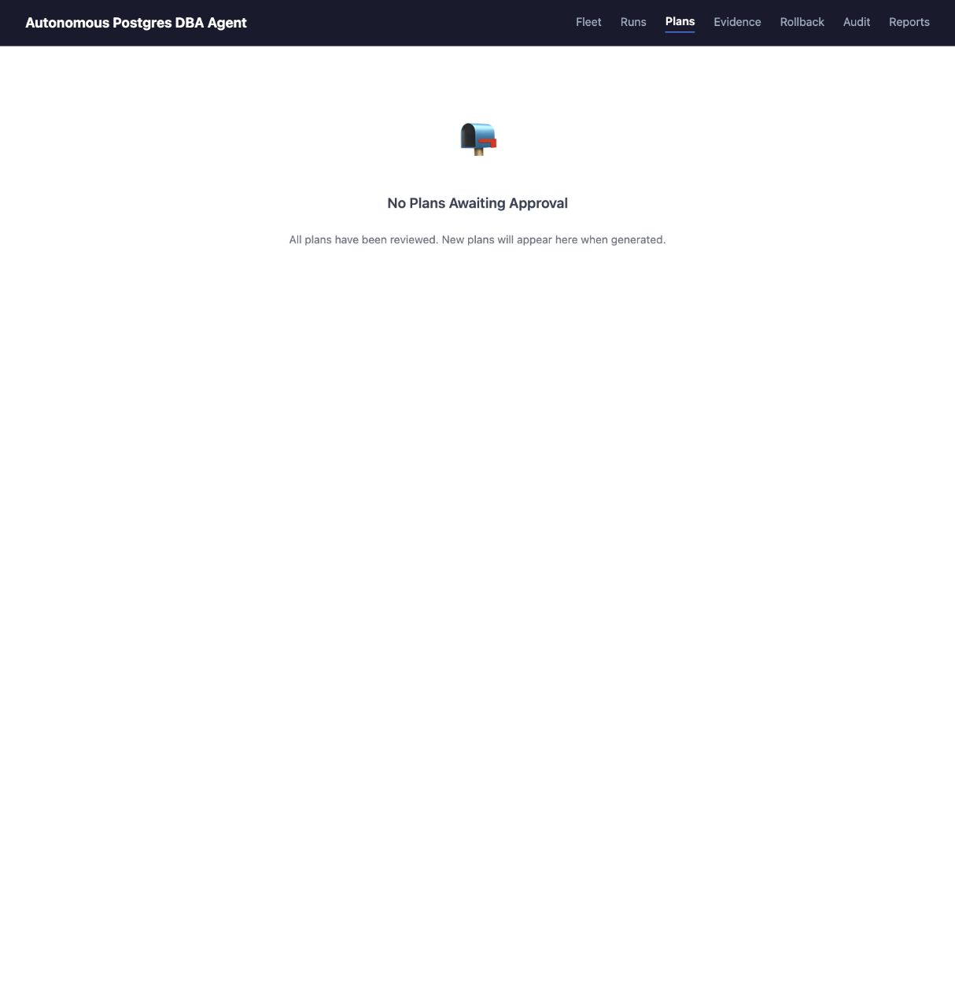
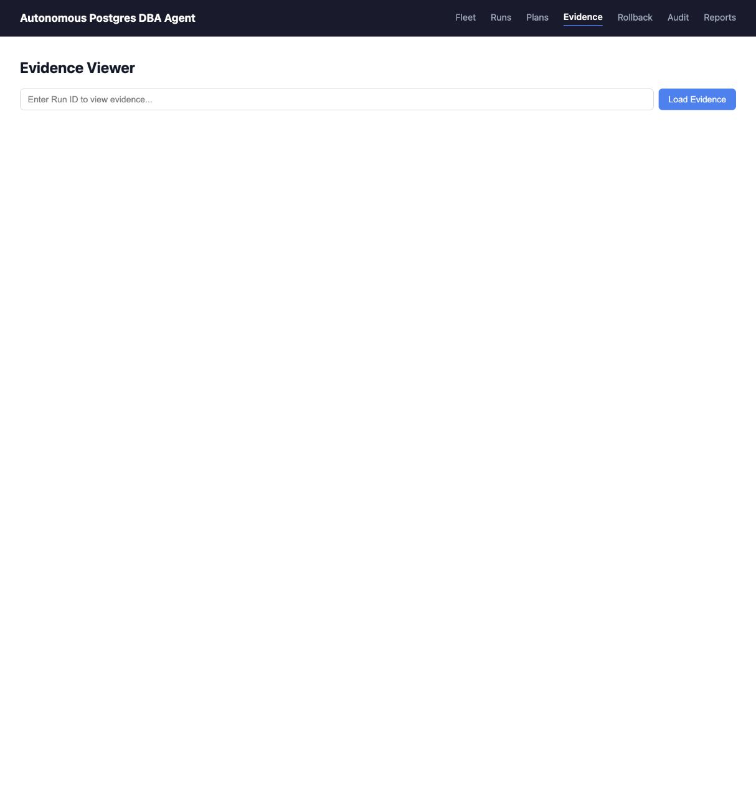
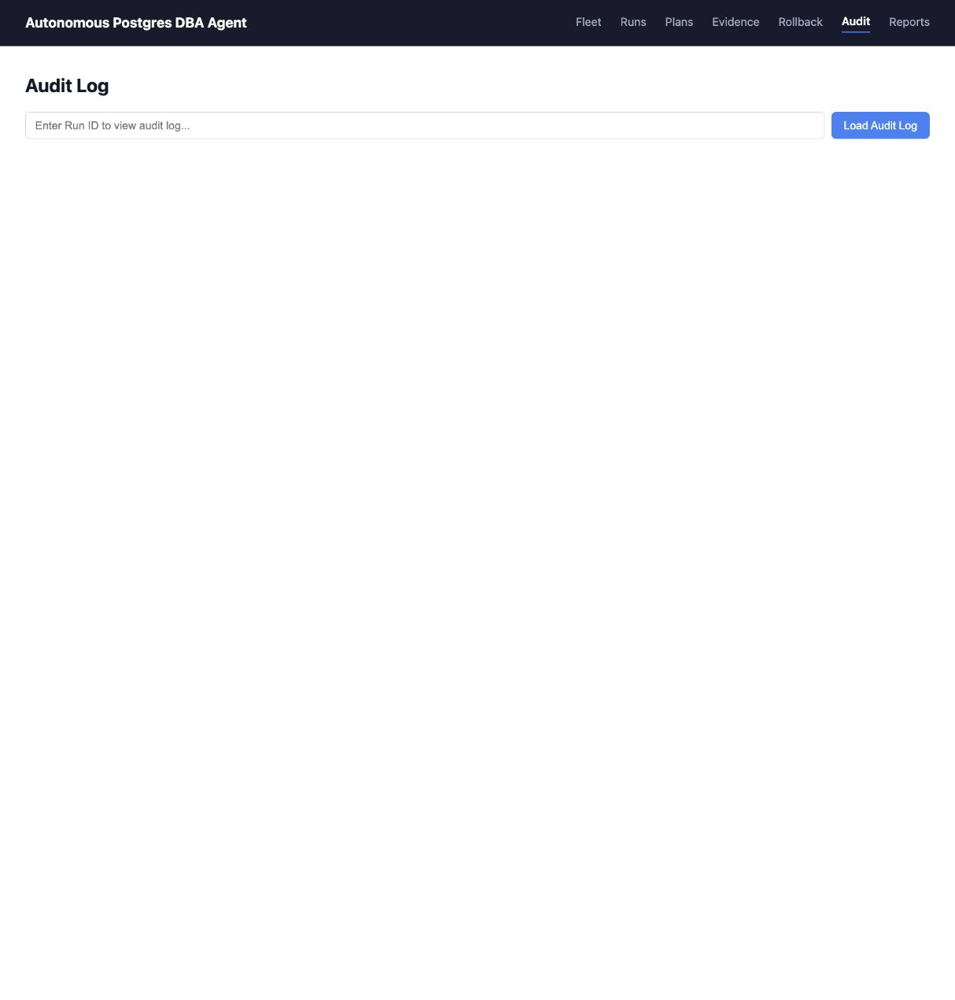
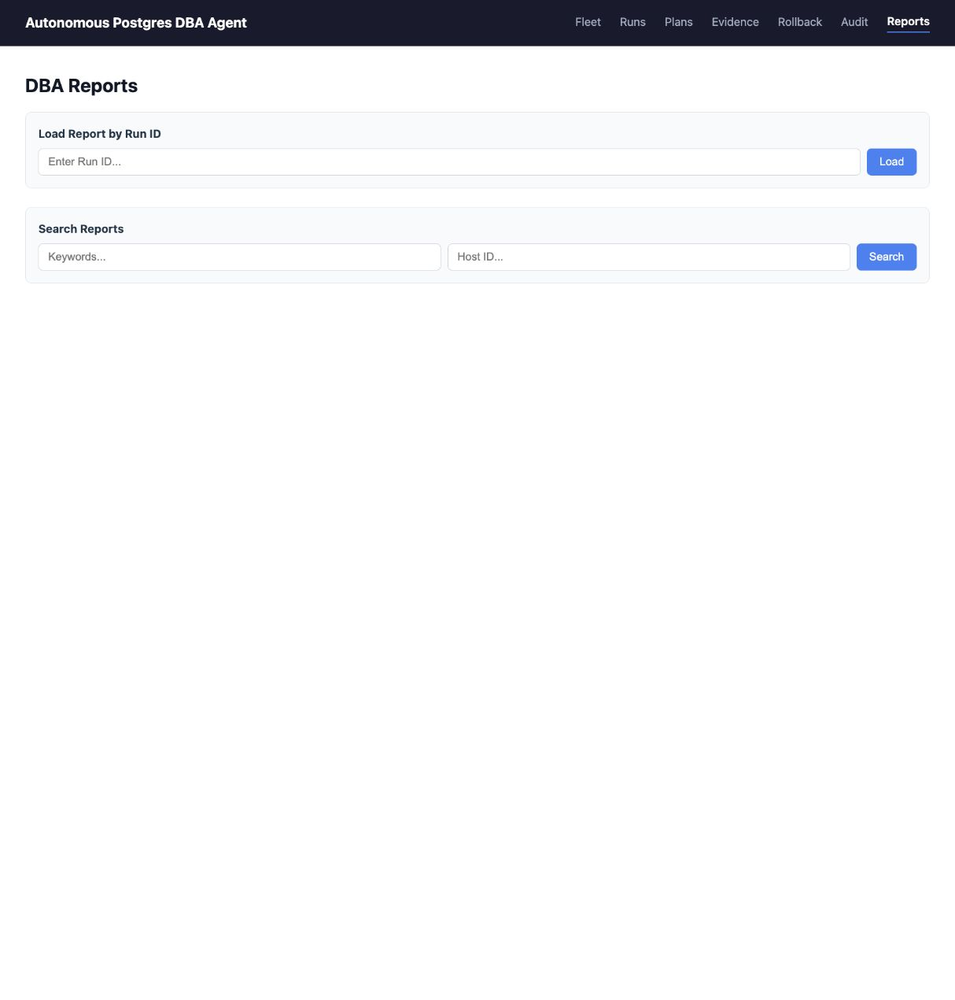

# DBTune Baseline and Production Readiness Audit

Date: 2026-07-10
Scope: current local checkout, the running frontend at `http://127.0.0.1:5173/`, and the six DBTune reference screenshots in `docs/postgres-dba-demo-assets/dbtune-reference/`.

## Verdict

The repository is a credible control-plane prototype, but it is not safe to connect to a production PostgreSQL database for autonomous tuning. The strongest foundations are the API/data model, evidence collectors, approval vocabulary, guardrail structure, audit trail, reports, tests, and container packaging. The main blocker is that the autonomous lifecycle is still largely simulated or unwired: most workflow steps are no-ops, dry-run performs metadata/basic SQL-pattern checks, rollback is simulated, verification is not called by the loop, and the loop supplies an empty pre-change snapshot.

The UI is also materially behind the supplied DBTune product baseline. DBTune is database-scoped and gives an operator dashboards, tuning policy, query fingerprints, configuration history, event logs, and guided agent setup. The current product is organized as global Fleet/Runs/Plans/Evidence/Rollback/Audit/Reports pages, with sparse empty states and several flows that require manually pasted UUIDs.

## Production blockers

### P0 - Must be complete before any production write

1. Implement the real execution lifecycle.
   - Persist a real pre-change snapshot.
   - Implement snapshot, diagnose, dry-run, apply, verify, measure, keep/rollback, and report handlers.
   - Wire `verification.py` and real rollback into the loop.
   - Verify each applied setting on the target and distinguish reload-only from restart-required changes.
   - Make all actions idempotent and recoverable after API, worker, Redis, or network failure.
   - Decide whether planning remains deterministic or uses an LLM. The current planner is rule-based; either path needs versioned policy, reproducible decision traces, evaluation cases, and a safe fallback.

2. Replace in-process background work with a durable worker/state machine.
   - Runs are currently launched with `asyncio.create_task`.
   - Active state is stored in a process-local dictionary while the production command starts two Uvicorn workers.
   - Add a durable queue, leases, retries, cancellation, reconciliation, and restart recovery.

3. Make safety fail closed.
   - Dry-run must validate against a disposable clone or an execution context that can model memory, parameter units, version compatibility, reload/restart semantics, and resource ceilings.
   - Audit recording must be transactional with approval; approval currently continues after audit failure.
   - Prove rollback restoration and fail the run if the restore cannot be verified.

4. Add an identity and trust boundary.
   - User authentication, organization/tenant separation, and RBAC.
   - Authenticated approver identity rather than caller-supplied `approved_by`/`rejected_by` strings.
   - Agent identity using mTLS or scoped rotating credentials, signed requests, replay protection, and TLS.
   - Least-privilege PostgreSQL roles, secrets management, production CORS policy, rate limits, and request-size limits.

5. Add real end-to-end safety tests.
   - Current tests use mocked database/control-plane dependencies.
   - Add disposable PostgreSQL integration tests for collect -> diagnose -> approve -> apply -> verify -> keep/rollback.
   - Include induced regressions, connection loss, process restarts, replica/primary role changes, long locks, and failed rollback.

### P1 - Required for a reliable first production release

6. Add production observability and operations.
   - Dependency-aware liveness/readiness checks for PostgreSQL and Redis.
   - Structured logs with run/plan/host correlation IDs, metrics, traces, dashboards, alerts, and SLOs.
   - Managed or highly available PostgreSQL/Redis, backups, restore drills, retention/partitioning, capacity limits, and disaster-recovery runbooks.
   - Forward collected OS metrics into heartbeat health evaluation or derive health from stored evidence.

7. Establish a release-quality gate.
   - CI/CD is absent.
   - Lock Python dependencies and pin base images by digest.
   - Resolve 232 strict mypy errors across 35 files.
   - Add the missing ESLint configuration and frontend tests.
   - Upgrade vulnerable development tooling: the full npm audit reports 8 issues (1 moderate, 7 high), although production dependencies report zero.
   - Add integration/E2E tests, migration checks, image scanning, secret scanning, SBOM/signing, and rollbackable deploys.

8. Bring the operator experience to the DBTune baseline.
   - Database-scoped navigation and a context header with version, CPU, memory, disk, and connection limits.
   - Performance dashboard and time-series charts.
   - Tuning mode, human-in-the-loop policy, reload/restart policy, objectives, iteration duration, parameter selection, and performance thresholds.
   - Query fingerprints with search, counts, recency, and drill-down.
   - Configuration history with before/after performance, parameter diffs, compare, apply, and download.
   - Guided agent setup and connection verification.
   - Searchable/filterable event logs.
   - Contextual links and actionable empty-state CTAs so operators do not paste UUIDs.

### P2 - Enterprise and scale readiness

9. Add SSO, fine-grained policy, separation of duties, approval escalation, notifications, data residency/retention controls, audit export, support/admin tooling, load tests, upgrade compatibility, and fleet-scale capacity testing.

## DBTune baseline comparison

| Capability | DBTune reference | Current product | Gap |
|---|---|---|---|
| Information architecture | Database-scoped workspace and compact left navigation | Global horizontal navigation | Add database context and operator-oriented hierarchy |
| Performance | Dense time-series dashboard with date/range controls | No performance dashboard | Build metrics model, aggregation, charts, and anomaly context |
| Tuning policy | Mode, approval, restart policy, targets, duration, parameters, thresholds | Backend defaults; no complete product surface | Make guardrails explicit, editable, versioned, and auditable |
| Query analysis | Searchable fingerprints | Raw evidence by pasted run ID | Normalize queries and add drill-down/history |
| Change history | Sessions, performance deltas, config diffs, compare/apply/download | Plans, audit, reports split across pages | Create one configuration-session view |
| Agent onboarding | Guided setup with connection checks | Empty fleet page with no CTA | Add install, credential, permissions, and verification flow |
| Event investigation | Search, time, severity, and code filters | Audit log by pasted run ID | Add fleet/database event stream and filters |

## Visual audit

### Reference direction

The supplied DBTune screenshots consistently use a light, dense operational layout: a left sidebar, a database context header, compact tabs/tables, and purpose-built controls. The dashboard is the strongest baseline because it makes system state legible before asking the operator to act.

### Current flow screenshots

1. **Fleet - needs work.** Clear empty-state copy, but there is no visible action to register a database or open an agent setup guide.

   

2. **Runs - needs work.** The workflow model is useful, but the empty state offers no way to select a database and start a run.

   

3. **Plans - needs work.** Human approval is correctly elevated in the information architecture, but an empty queue has no path to the run or database that produces a plan.

   

4. **Evidence - needs work.** A user must already know and paste a Run ID; this should be reachable from a database/run context with evidence type, time, and quality filters.

   

5. **Rollback - critical UX risk.** The highest-consequence action begins with a manually pasted Plan ID. Rollback should be attached to an applied configuration session with target, impact, eligibility, and confirmation context.

   

6. **Audit - needs work.** The page requires a Run ID and lacks the DBTune baseline's time, severity, code, database, actor, and action filters.

   

7. **Reports - fair foundation.** Keyword and Host ID search are useful, but the page is disconnected from the database/run/configuration workflow and has a very large empty canvas.

   

## Visual strengths

- Consistent global navigation, headings, spacing, status/table primitives, and error/empty-state vocabulary.
- Approval, rollback, evidence, audit, and reporting are treated as first-class operator concepts.
- The interface is visually calm and readable, which is a good base for a denser operational product.

## Accessibility and responsive risks

- Several inputs rely on placeholders instead of persistent visible labels.
- Empty states use a mailbox emoji as the primary visual, which may be announced unpredictably and does not explain the next action.
- Active navigation and disabled-button states depend heavily on color; keyboard focus was not established in this screenshot audit.
- The seven-link horizontal header has no visible responsive behavior and is likely to crowd or overflow on narrow viewports.
- Screenshots alone cannot establish screen-reader behavior, focus order, keyboard completion, contrast compliance, reduced motion, or zoom/reflow support.

## Verification snapshot

- Backend tests: 511 passed.
- Ruff: passed.
- Frontend production build: passed.
- Backend and frontend Docker images: built successfully.
- PostgreSQL 16 and Redis 7 containers: healthy on the local development ports.
- Frontend production dependency audit: 0 vulnerabilities.
- Full frontend dependency audit: 8 vulnerabilities in the development toolchain (1 moderate, 7 high).
- Frontend lint: blocked because no ESLint configuration exists.
- Strict mypy: 232 errors in 35 files.
- No CI workflow, real database integration suite, browser E2E suite, Python lockfile, infrastructure-as-code, or operational runbook was found.

## Limitations

- The visual review covers the empty-state product because no live managed database/run data was present in the captured UI.
- No production database was connected and no apply/rollback action was executed.
- The audit is static and local; it does not prove cloud network controls, real-user performance, multi-tenant isolation, disaster recovery, or accessibility compliance.
